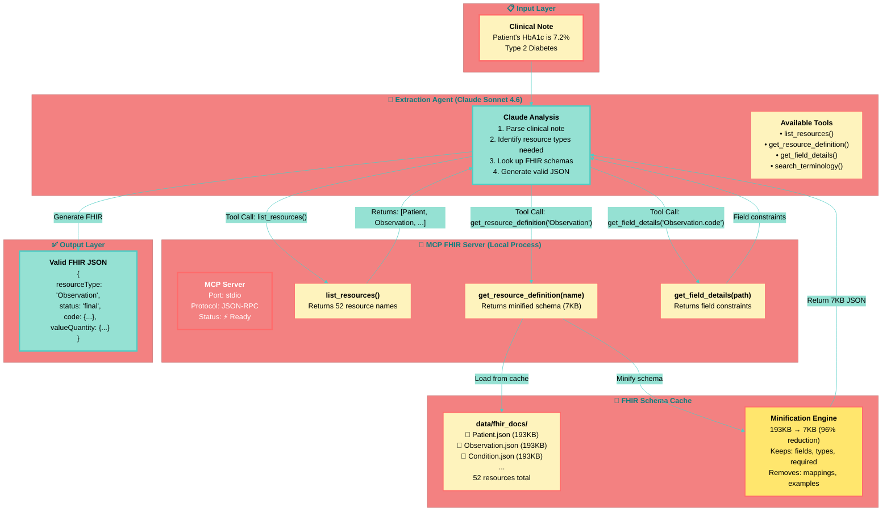

# Diagram 1: MCP Architecture - Agent ↔ MCP ↔ Cache

**Caption:** The MCP architecture enables dynamic schema lookup. The agent queries the MCP server for FHIR specifications on-demand, receiving minified schemas (96% smaller) from a local cache. This eliminates context window bloat and hallucinations.
