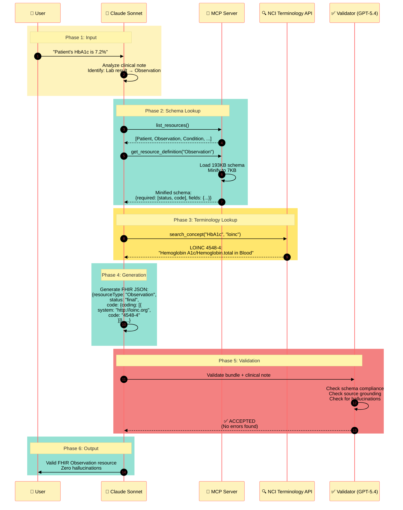

# Diagram 2: Lookup-Then-Extract Pattern Flow

**Caption:** The Lookup-Then-Extract pattern ensures accuracy by querying specifications before generation. The agent first discovers available resources, retrieves their schemas, looks up standardized terminology codes, then generates FHIR JSON. A separate validator agent provides quality assurance.
