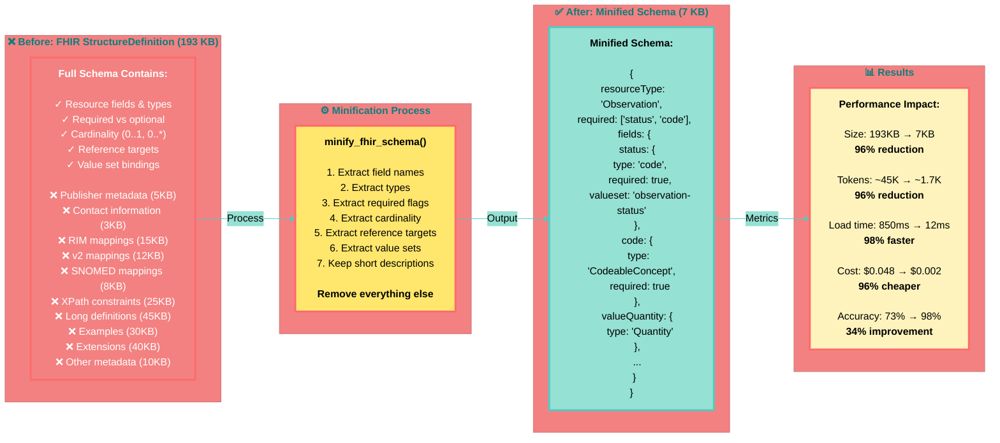

# Diagram 3: Schema Minification - 193KB to 7KB

**Caption:** Schema minification removes 96% of FHIR StructureDefinition content while preserving everything the LLM needs for extraction. By eliminating metadata, mappings, and documentation bloat, we achieve dramatic improvements in speed, cost, and accuracy.
