# Diagram 4: Performance Comparison - Traditional vs MCP

```mermaid
%%{init: {'theme':'base', 'themeVariables': { 'primaryColor':'#FEF3BD','primaryTextColor':'#000','primaryBorderColor':'#FF6B6B','lineColor':'#4ECDC4','secondaryColor':'#95E1D3','tertiaryColor':'#F38181'}}}%%

graph TB
    subgraph Comparison["<b>Performance Comparison: 1,000 Clinical Notes</b>"]

        subgraph Approach1["<b>❌ Approach 1: Full Schema in Prompt</b>"]
            A1_Input["<b>Input</b><br/>Clinical note +<br/>193KB FHIR schema"]
            A1_Process["<b>Processing</b><br/>Claude Sonnet<br/>~45K tokens/request"]
            A1_Output["<b>Output</b><br/>FHIR JSON<br/>(with hallucinations)"]

            A1_Metrics["<b>Metrics</b><br/>⏱️ Latency: 12.3s avg<br/>💰 Cost: $0.18/note<br/>🎯 Accuracy: 73%<br/>🚨 Hallucinations: 27%<br/><br/><b>Total for 1K notes:</b><br/>$180 | 3.4 hours"]

            A1_Input --> A1_Process --> A1_Output --> A1_Metrics
        end

        subgraph Approach2["<b>⚠️ Approach 2: RAG + Embeddings</b>"]
            A2_Input["<b>Input</b><br/>Clinical note +<br/>Vector search query"]
            A2_Embed["<b>Embedding Search</b><br/>Retrieve relevant<br/>schema chunks"]
            A2_Process["<b>Processing</b><br/>Claude Sonnet<br/>~12K tokens/request"]
            A2_Output["<b>Output</b><br/>FHIR JSON<br/>(some hallucinations)"]

            A2_Metrics["<b>Metrics</b><br/>⏱️ Latency: 8.1s avg<br/>💰 Cost: $0.09/note<br/>🎯 Accuracy: 81%<br/>🚨 Hallucinations: 14%<br/><br/><b>Total for 1K notes:</b><br/>$90 | 2.3 hours"]

            A2_Input --> A2_Embed --> A2_Process --> A2_Output --> A2_Metrics
        end

        subgraph Approach3["<b>✅ Approach 3: MCP (Our Solution)</b>"]
            A3_Input["<b>Input</b><br/>Clinical note"]
            A3_MCP["<b>MCP Lookup</b><br/>Dynamic schema fetch<br/>7KB minified"]
            A3_Process["<b>Processing</b><br/>Claude Sonnet<br/>~1.7K tokens/request"]
            A3_Output["<b>Output</b><br/>Valid FHIR JSON<br/>(minimal hallucinations)"]

            A3_Metrics["<b>Metrics</b><br/>⏱️ Latency: 6.4s avg<br/>💰 Cost: $0.04/note<br/>🎯 Accuracy: 98%<br/>🚨 Hallucinations: 2%<br/><br/><b>Total for 1K notes:</b><br/>$40 | 1.8 hours"]

            A3_Input --> A3_MCP --> A3_Process --> A3_Output --> A3_Metrics
        end

        subgraph Approach4["<b>🚀 Approach 3b: MCP + Caching</b>"]
            A4_Input["<b>Input</b><br/>Clinical note"]
            A4_Cache["<b>Warm Cache</b><br/>Pre-loaded schemas<br/>Instant lookup"]
            A4_Process["<b>Processing</b><br/>Claude Sonnet<br/>Parallel tool calls"]
            A4_Output["<b>Output</b><br/>Valid FHIR JSON"]

            A4_Metrics["<b>Metrics</b><br/>⏱️ Latency: 4.2s avg<br/>💰 Cost: $0.03/note<br/>🎯 Accuracy: 98%<br/>🚨 Hallucinations: 2%<br/><br/><b>Total for 1K notes:</b><br/>$30 | 1.2 hours"]

            A4_Input --> A4_Cache --> A4_Process --> A4_Output --> A4_Metrics
        end
    end

    subgraph Savings["<b>💰 Cost Savings Analysis</b>"]
        Calc["<b>Hospital Processing 50K Notes/Month</b><br/><br/>Traditional (Approach 1):<br/>50,000 × $0.18 = <b>$9,000/month</b><br/><br/>MCP + Cache (Approach 3b):<br/>50,000 × $0.03 = <b>$1,500/month</b><br/><br/><b>Savings: $7,500/month</b><br/><b>Annual savings: $90,000</b><br/><br/>Plus: 93% reduction in hallucinations<br/>Fewer downstream errors to fix"]
    end

    style A1_Metrics fill:#F38181,stroke:#FF6B6B,stroke-width:3px,color:#fff
    style A2_Metrics fill:#FFE66D,stroke:#FF6B6B,stroke-width:2px,color:#000
    style A3_Metrics fill:#95E1D3,stroke:#4ECDC4,stroke-width:3px,color:#000
    style A4_Metrics fill:#95E1D3,stroke:#4ECDC4,stroke-width:4px,color:#000
    style Calc fill:#FEF3BD,stroke:#FF6B6B,stroke-width:3px,color:#000
```

**Caption:** Benchmarking across 1,000 clinical notes shows MCP dramatically outperforms traditional approaches. By eliminating schema bloat and using dynamic lookup, we achieve 48% faster extraction, 78% lower cost, and 34% higher accuracy compared to full-schema-in-prompt approaches.
