# Diagram 5: Real Production Trace - Complete Extraction Flow

```mermaid
%%{init: {'theme':'base', 'themeVariables': { 'primaryColor':'#FEF3BD','primaryTextColor':'#000','primaryBorderColor':'#FF6B6B','lineColor':'#4ECDC4','secondaryColor':'#95E1D3','tertiaryColor':'#F38181'}}}%%

stateDiagram-v2
    [*] --> InputReceived: User submits clinical note

    state InputReceived {
        [*] --> Parse
        Parse: 📋 "Patient's HbA1c is 7.2%"
        Parse: ⏱️ t=0ms
    }

    InputReceived --> AgentAnalysis: Extract resources

    state AgentAnalysis {
        [*] --> Analyze
        Analyze: 🤖 Claude Sonnet analyzing...
        Analyze: ⏱️ t=100ms
        Analyze: 💭 "I see a lab result"
        Analyze: 💭 "Need to use Observation resource"
    }

    AgentAnalysis --> ListResources: Call MCP tool

    state ListResources {
        [*] --> ToolCall1
        ToolCall1: 🔌 list_resources()
        ToolCall1: ⏱️ t=250ms
        ToolCall1: 📤 Request: {}
        ToolCall1 --> ToolResponse1
        ToolResponse1: 📥 Response: [Patient, Observation, ...]
        ToolResponse1: ✅ 52 resources available
    }

    ListResources --> GetSchema: Select Observation

    state GetSchema {
        [*] --> ToolCall2
        ToolCall2: 🔌 get_resource_definition("Observation")
        ToolCall2: ⏱️ t=300ms
        ToolCall2: 📂 Load: data/fhir_docs/Observation.json
        ToolCall2 --> Minify
        Minify: ⚙️ Minify: 193KB → 7KB
        Minify: ⏱️ Processing: 12ms
        Minify --> ToolResponse2
        ToolResponse2: 📥 Response: Minified schema
        ToolResponse2: ✅ required: [status, code]
        ToolResponse2: ✅ fields: {status, code, value*, ...}
    }

    GetSchema --> LookupCode: Need LOINC code

    state LookupCode {
        [*] --> ToolCall3
        ToolCall3: 🔍 search_terminology("HbA1c", "loinc")
        ToolCall3: ⏱️ t=350ms
        ToolCall3: 🌐 NCI EVS API call
        ToolCall3 --> ToolResponse3
        ToolResponse3: 📥 Response: LOINC 4548-4
        ToolResponse3: ✅ "Hemoglobin A1c/Hemoglobin.total in Blood"
    }

    LookupCode --> Generate: All info gathered

    state Generate {
        [*] --> CreateJSON
        CreateJSON: 🎨 Generating FHIR JSON...
        CreateJSON: ⏱️ t=1200ms
        CreateJSON: ✓ resourceType: Observation
        CreateJSON: ✓ status: final (required)
        CreateJSON: ✓ code: {LOINC 4548-4} (required)
        CreateJSON: ✓ valueQuantity: {7.2, %}
        CreateJSON: ✅ No hallucinated fields
    }

    Generate --> PythonValidation: Validate schema

    state PythonValidation {
        [*] --> SchemaCheck
        SchemaCheck: ✅ Python fhir.resources validation
        SchemaCheck: ⏱️ t=1850ms
        SchemaCheck: ✓ All required fields present
        SchemaCheck: ✓ All types correct
        SchemaCheck: ✓ No invalid fields
        SchemaCheck: <b>PASS</b>
    }

    PythonValidation --> GPTValidation: Second validation

    state GPTValidation {
        [*] --> GPTCheck
        GPTCheck: ✅ GPT-5.4 validation
        GPTCheck: ⏱️ t=2500ms
        GPTCheck: ✓ Schema compliance
        GPTCheck: ✓ Source grounding
        GPTCheck: ✓ No hallucinations
        GPTCheck: ✓ Clinical accuracy
        GPTCheck: <b>ACCEPTED</b>
    }

    GPTValidation --> OutputReturned: Success

    state OutputReturned {
        [*] --> Return
        Return: 📤 Return valid FHIR JSON
        Return: ⏱️ t=2520ms (total)
        Return: 💾 Save to output file
        Return: ✅ Extraction complete
    }

    OutputReturned --> [*]: Done

    note right of InputReceived
        <b>Phase 1: Input</b>
        Parse clinical note
        Identify extraction task
    end note

    note right of ListResources
        <b>Phase 2: Discovery</b>
        Query available resources
        Select appropriate type
    end note

    note right of GetSchema
        <b>Phase 3: Schema Lookup</b>
        Load FHIR specification
        Minify for LLM consumption
    end note

    note right of LookupCode
        <b>Phase 4: Terminology</b>
        Standardize medical codes
        LOINC, SNOMED, RxNorm
    end note

    note right of Generate
        <b>Phase 5: Generation</b>
        Create valid FHIR JSON
        Follow spec exactly
    end note

    note right of GPTValidation
        <b>Phase 6: Validation</b>
        Dual validation approach
        Python + GPT-5.4
    end note
```

**Caption:** A real production trace showing the complete extraction flow from clinical note to validated FHIR resource. Total time: 2.5 seconds. The system performs 3 tool calls (list, get schema, lookup code) before generating JSON, then validates with both Python schema checking and GPT-5.4 quality review. Zero hallucinations.
